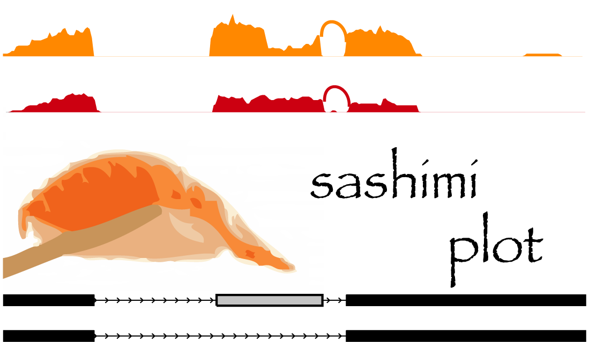

.. include:: <isogrk3.txt>

.. sashimi_plot documentation master file, created by .. 
   sphinx-quickstart on Fri Oct 22 16:50:57 2010.
   You can adapt this file completely to your liking, but it should at least
   contain the root `toctree` directive.

.. contents::

What is sashimi_plot?
=====================

``sashimi_plot`` is a utility for automatically producing publication-quality plots Sashimi plots for RNA-Seq analyses of isoform expression. It is part of the `MISO`_ framework. In particular, ``sashimi_plot`` can: (1) plot raw RNA-Seq densities along exons and junctions for multiple samples, while simultaneously visualizing the gene model/isoforms to which reads map, and (2) plot MISO output alongside the raw data or separately. Sashimi plots can also be made from IGV (see :ref:`igv-sashimi`).

Sashimi plots are described here:

Katz, Y, Wang ET, Silterra J, Schwartz S, Wong B, Thorvaldsdóttir H, Robinson JT, Mesirov JP, Airoldi EM, Burge, CB. `Sashimi plots: Quantitative visualization of alternative isoform expression from RNA-seq data <http://biorxiv.org/content/early/2014/02/11/002576>`_

The MISO framework is described in Katz et. al., `Analysis and design of RNA sequencing experiments for identifying isoform regulation`_. *Nature Methods* (2010).

  .. figure:: images/sashimi-plot-example.png 
      :scale: 80%
      :figclass: align-center
      :align: center
      :alt: An example plot made by sashimi_plot

      *An example figure produced by* ``sashimi_plot`` 

Features
========

* Plots RNA-Seq read densities along exons and junctions, as well as
  visualizes the structure of the gene's isoforms
* Plots of MISO estimates (including full distribution and/or
  confidence intervals) for the events in question, showing the
  estimates for multiple samples in parallel
* Plots insert length distributions for paired-end RNA-Seq samples
* Allows visualization of multiple samples on the same figure
* Generates publication-quality figures in a variety of flexible
  formats (including PDF and PNG)

Why is it called sashimi_plot?
==============================

We chose "Sashimi" because our tool plots the *raw* RNA-Seq data in addition to inferences made about the RNA-Seq reads (hat tip to Vincent Butty.) Also, the variations and various "bumps" in exonic read densities in RNA-Seq data look a bit like rolls of Sashimi. Besides, we thought sashimi would go well with `MISO`_.
 

Updates
=======

**2014**

* **Tue, Feb 11**: Sashimi plot paper is now `on the bioRxiv <http://biorxiv.org/content/early/2014/02/11/002576>`_.

**2013**

* **Wed, May 15**: Sashimi plot is now part of the Broad Integrated Genome Viewer (IGV) browser. 

**2012**

* **Wed, Feb 1**: New features:

 - Dynamic but consistent y-axis scaling: if ``ymax`` is omitted, the same yscale will be chosen for all samples, whose maximum value is determined by the maximum y-value across all samples being plotted.
 
 - x-axis for ``bar_posterior`` feature is now thinner and has smaller ticks, which results in much better visualization (especially if you're plotting many samples.)

* **Sun, Jan 8**: Several changes:

 - Bugfix for scenario that caused plots to fail with ``KeyError`` on some events

 - Now skipping reads with insertions or deletions in their CIGAR strings

 - Figure height/width now correctly read from settings file

 - Optional ``sample_labels`` argument for labeling each sample's track in ``--plot-event``

Thanks to Sol Katzman, Michael Lovci, Sean O'Keeffe and Vincent Butty for their contributions and suggestions.

* **Tue, Jan 3**: Added feature for plotting the distribution Bayes factors (``--plot-bf-dist``). Note that this feature is only available in ``misopy-0.2`` and higher.

**2011**

* **Mon, Dec 26**: We've reorganized the codebase to be a proper Python module that is part of MISO. This forced us to change the name from ``sashimi-plot`` to ``sashimi_plot`` (underscore now instead of dash), so please change your code accordingly. ``sashimi_plot`` can now be imported as a module (using ``misopy.sashimi_plot``) and no longer relies on MISO being explicitly in your path. We also fixed some issues with CIGAR string parsing and fixed other minor bugs.

* **Mon, Dec 19**: Added support for all event types from MISO annotation. Previous versions could not handle ALE/AFE events properly.

* **Sun, Dec 18**: ``sashimi_plot`` now recursively searches the subdirectories of paths given in the ``miso_files`` section of the configuration file to find the ``.miso`` file associated with an event. This should allow more flexibility in organization of MISO output directories that the plotting program recognizes.

* **Sat, Dec 3**: ``sashimi_plot`` is released!

Installation
============

``sashimi_plot`` comes packaged with `MISO`_. If you have MISO installed, you already have ``sashimi_plot``. 
``sashimi_plot`` itself only requires the Python package `matplotlib`_ (version 1.1.0 or higher) as well as `samtools`_. 

Testing sashimi_plot
------------------------
.. _Testing sashimi_plot:

To test that ``sashimi_plot`` is working, we first need to get a GFF annotation of the alternative events to be visualized. An example GFF annotation file of events is provided in ``sashimi_plot/test-data/events.gff``. This GFF file has to be indexed in order to be used with MISO, with the ``index_gff`` script: ::

  cd sashimi_plot/
  index_gff --index test-data/events.gff test-data/event-data/

We can now plot this event by running the following from within the ``sashimi_plot`` directory in MISO: ::

  sashimi_plot --plot-event "chr17:45816186:45816265:-@chr17:45815912:45815950:-@chr17:45814875:45814965:-" test-data/event-data/ settings/sashimi_plot_settings.txt --output-dir test-plot

If successful, you should get a plot in the directory ``test-plot/`` called ``chr17:45816186:45816265:-@chr17:45815912:45815950:-@chr17:45814875:45814965:-.pdf``. An annotated graphical explanation of the main features of the output is shown below.

  .. figure:: images/sashimi-plot-example-annotated.png 
      :scale: 35%
      :figclass: align-center
      :align: center
      :alt: sashimi_plot example with annotations

      ``sashimi_plot`` *example figure with annotations*

Key items to notice: 

* The RNA-Seq read densities along exons are shown as histograms, color-coded by the sample. The RNA-Seq densities are aligned to the isoforms drawn at the bottom of the plot, which are automatically read from the GFF annotation of the events given as input.
* Junction reads are visualized as arcs connecting the pair of exons that the junction borders. The thickness of the arc is in proportion to the number of junction reads present in the sample, but the actual number of junction reads can be optionally plotted too (as in the main example.)
* MISO expression estimates are (optionally) shown on the right, including the full posterior distribution (as black histograms) over |Psi|, with the |Psi| estimate drawn as a thick red line and lower and upper 95% confidence intervals plotted as dotted grey lines. The actual value of |Psi| along with the value of each confidence interval bound is shown to the right of the histograms.

Overview
========
.. _config:

Visualizing RNA-Seq reads along isoforms with MISO estimates
------------------------------------------------------------

We return to our main test example of the ``--plot-event`` feature. The call: ::

  sashimi_plot --plot-event "chr17:45816186:45816265:-@chr17:45815912:45815950:-@chr17:45814875:45814965:-" test-data/event-data/ settings/sashimi_plot_settings.txt --output-dir test-plot

Plots the event called ``chr17:45816186:45816265:-@chr17:45815912:45815950:-@chr17:45814875:45814965:-``, using the directory pickled event ``test-data/event-data/`` and plotting according to the information provided in the settings file ``settings/sashimi_plot_settings.txt``. The name of this event in this case is simply the ID given to this skipped exon in the GFF annotations provided with MISO (see `Mouse genome (mm9) alternative events`_). The name is arbitrary, and ``sashimi_plot`` will visualize whatever events you give it as long as they have a corresponding indexed GFF file. 

The directory containing the event/gene isoform information (in the above example, ``test-data/event-data``) can be any directory generated by indexing a GFF3 file, using the ``index_gff`` script that is part of MISO. For more information on indexing, see :ref:`indexing-annotation`.

The settings file for ``sashimi_plot`` specifies the name of each of the samples to be plotted, the directory containing their corresponding BAM files and MISO output, and a variety of plotting parameters, such as the figure colors and dimensions. The example settings file ``settings/sashimi_plot_settings.txt`` is: ::

  [data]
  # directory where BAM files are
  bam_prefix = ./test-data/bam-data/
  # directory where MISO output is
  miso_prefix = ./test-data/miso-data/

  bam_files = [
      "heartWT1.sorted.bam",
      "heartWT2.sorted.bam",
      "heartKOa.sorted.bam",
      "heartKOb.sorted.bam"]

  miso_files = [
      "heartWT1",
      "heartWT2",
      "heartKOa",
      "heartKOb"]

  [plotting]
  # Dimensions of figure to be plotted (in inches)
  fig_width = 7
  fig_height = 5 
  # Factor to scale down introns and exons by
  intron_scale = 30
  exon_scale = 4
  # Whether to use a log scale or not when plotting
  logged = False 
  font_size = 6

  # Max y-axis
  ymax = 150

  # Whether to plot posterior distributions inferred by MISO
  show_posteriors = True 

  # Whether to show posterior distributions as bar summaries
  bar_posteriors = False

  # Whether to plot the number of reads in each junction
  number_junctions = True

  resolution = .5
  posterior_bins = 40
  gene_posterior_ratio = 5

  # List of colors for read denisites of each sample
  colors = [
      "#CC0011",
      "#CC0011",
      "#FF8800",
      "#FF8800"]

  # Number of mapped reads in each sample
  # (Used to normalize the read density for RPKM calculation)
  coverages = [
      6830944,
      14039751,
      4449737, 
      6720151]

  # Bar color for Bayes factor distribution
  # plots (--plot-bf-dist)
  # Paint them blue
  bar_color = "b"

  # Bayes factors thresholds to use for --plot-bf-dist
  bf_thresholds = [0, 1, 2, 5, 10, 20]

The above settings file specifies where the BAM files for each sample are (and their corresponding MISO output files) and also controls several useful plotting parameters. The parameters are:

 * ``bam_prefix``: directory where BAM files for the samples to plot are. These BAM files should be coordinate-sorted and indexed.
 * ``miso_prefix``: directory where MISO output directories are for the events to be plotted. For example, if plotting a skipped exon event for which the MISO output lives in ``/data/miso_output/SE/``, then ``miso_prefix`` should be set to ``/data/miso_output/SE``. 
 * ``bam_files``: list of BAM files for RNA-Seq samples in the order in which you'd like them to be plotted. Each value in the list should be a filename that resides in the directory specified by ``bam_prefix``.
 * ``miso_files``: list of MISO output directories for each sample. Should follow same order of samples as ``bam_files``. Each value in the list should be a MISO output directory that resides in the directory specified by ``miso_prefix``.

  .. note::
     ``sashimi_plot`` will look recursively in paths of ``miso_files`` to find the MISO output file (ending in ``.miso``) associated with the event that is being plotted. For example, if we have these settings: ::

         miso_prefix = /miso/output/
         miso_files = ['control']

     If our event is on a chromosome called ``chr7`` in the annotation, then the program will check every subdirectory of ``/miso/output/control`` for a directory called ``chr7``, and look for a file that has the form ``event_name.miso`` in that directory. If it cannot find such a directory in the first-level subdirectories, it will recurse into the subdirectories until it can find the file or until there are no more subdirectories to search.

* ``fig_width``: output figure's width (in inches.)
 * ``fig_height``: output figure's height (in inches.)
 * ``exon_scale`` / ``intron_scale``: factor by which to scale down exons and introns, respectively.
 * ``logged``: whether to log the RNA-Seq read densities (set to ``False`` for linear scaling)
 * ``ymax``: maximum value of y-axis for RNA-Seq read densities. If not given, then the highest y-axis value across all samples will be set for each, resulting in comparable y-scaling.
 * ``show_posteriors``: plot MISO posterior distributions if ``True``, do not if ``False``
 * ``bar_posteriors``: plot MISO posterior distributions not as histograms, but as a horizontal bar that simply shows the mean and confidence intervals of the distribution in each sample.
 * ``colors``: Colors to use for each sample. Colors should be listed in same order as ``bam_files`` and ``miso_files`` lists.
 * ``coverages``: Number of mapping reads in each sample, for use when when computing normalized (i.e. RPKM) RNA-Seq read densities. Should be listed in same order as ``bam_files`` and ``miso_files``. These numbers correspond to the "per million" denominators used for calculating RPKM.

**Additional parameters (all optional):**

 * ``sample_labels``: a list of string labels for each sample. By default, ``sashimi_plot`` will use the BAM filename from ``bam_files`` as the label for the sample. This option provides alternative labels. Note that ``sample_labels`` must have the same number of entries as ``bam_files``.
 * ``reverse_minus``: specifies whether minus strand (``-``) event isoforms are to be plotted in same direction as plus strand events. By default, set to ``False``, meaning minus strand events will be plotted in direction opposite to plus strand events.
 * ``nxticks``: number of x-axis ticks to plot
 * ``nyticks``: number of y-axis ticks to plot

.. note::
  For junction visualization, ``sashimi_plot`` currently uses only reads that cross *a single* junction. If a read crosses multiple exon-exon junctions, it is currently skipped, although MISO will use such a read in isoform estimation if it consistent with the given isoform annotation. Also, ``sashimi_plot`` currently ignores reads containing insertions or deletions and does not visualize sequence mismatches.
 

Command-line options
--------------------

``sashimi_plot`` takes the following arguments: ::

  --plot-insert-len
                        Plot the insert length distribution from a given
                        insert length (*.insert_len) filename. Second
                        argument is a settings filename.
  --plot-bf-dist
                        Plot Bayes factor distributon. Takes the arguments:
                        (1) Bayes factor filename (*.miso_bf) settings
                        filename, (2) a settings filename.
  --plot-event
                        Plot read densities and MISO inferences for a given
                        alternative event. Takes the arguments: (1) event name
                        (i.e. the ID= of the event based on MISO gff3
                        annotation file, (2) directory where MISO output is
                        for that event type (e.g. if event is a skipped exon,
                        provide the directory where the output for all SE
                        events are), (3) path to plotting settings file.
  --output-dir
                        Output directory.

.. _igv-sashimi:

Making Sashimi plots from IGV
=============================

To create Sashimi plot within IGV, download the snapshot release of IGV:

`IGV Browser snapshot (http://www.broadinstitute.org/igv/projects/downloads/snapshot/IGV_snapshot.zip) <http://www.broadinstitute.org/igv/projects/downloads/snapshot/IGV_snapshot.zip>`_

Run IGV with the Sashimi plot feature enabled: ::

  java -jar -Xmx2g -DenableSashimi="true" igv.jar

Load the RNA-Seq samples as BAM tracks.  Navigate to the region of interest, right click the tracks window and select "Sashimi plot" from the menu. A customizable Sashimi plot will appear in a new window, which can be saved in PNG or SVG formats.

Visualizing and plotting MISO output
====================================

MISO comes with several built-in utilities for plotting its output, which all make use of the Python ``matplotlib`` environment package. These can be accessed through the ``sashimi_plot`` utility.

Customizing the appearance of MISO estimates alongside raw RNA-Seq data
-----------------------------------------------------------------------

In the main example of ``--plot-event`` shown above, the MISO posterior distributions are shown fully as a histogram. Sometimes it's easier to compare a group of samples by just comparing the mean expression level (along with confidence intervals) in each sample, without plotting the entire distribution. Using the ``bar_posteriors`` option in the settings file, this can be done. Setting: ::

  bar_posteriors = True

yields the plot below:

.. image:: images/plot_event_bar_posteriors.png
  :scale: 80%
  :align: center
  :alt: Showing summaries of MISO posterior distributions as horizontal bars

The mean of each sample's posterior distribution over |Psi| is shown as a circle, with horizontal error bars extending to the upper and lower bounds of the confidence interval in each sample. Since the x-axis remains fixed in all samples, this makes it easy to visually compare the means of all samples and the overlap between their confidence intervals.

Plotting the distribution of events with Bayes factors
------------------------------------------------------

It is often useful to plot the distribution of events that meet various Bayes factor thresholds. For any Bayes factor threshold, we can compute the number of events that meet that threshold in a given comparison file and visualize this as a distribution. The option ``--plot-bf-dist`` does this, as follows: ::

  sashimi_plot --plot-bf-dist control_vs_knockdown.miso_bf settings.txt --output-dir plots/

This will plot the distribution of events meeting various Bayes factors thresholds in the file ``control_vs_knockdown.miso_bf`` (outputted by calling ``--compare-samples`` in MISO) using the plotting settings file ``settings.txt``, and output the resulting plot to ``plots/``. The resulting plot will look like:
 
  .. figure:: images/bf_dist.png
      :scale: 50%
      :figclass: align-center
      :align: center
      :alt: Distribution of events meeting various Bayes factor thresholds

      *Distribution of events meeting various Bayes factor thresholds*

This figure shows the number of events (in logarithmic scale) in the ``.miso_bf`` file that have Bayes factor greater than or equal to 0, greater than or equal to 1, greater than or equal to 2, etc. all the way to events with Bayes factor greater than or equal to 20. 

The title of the plot says how many of the events in the input ``.miso_bf`` file were used in plotting the distribution. In the above example all 5231 entries in the file were used, but if the lowest Bayes factor threshold for the x-axis was set to be 2, for example, then only a subset of the entries would be plotted since there are events with Bayes factor less than 2. 

The color of the bars used in the plot and Bayes factor thresholds for the x-axis can be customized through the setting file options ``bar_color`` and ``bf_thresholds``, respectively. The default settings are: ::

  # Color of bar for --plot-bf-dist
  bar_color = "b"

  # Bayes factor thresholds for --plot-bf-dist
  bf_thresholds = [0, 1, 2, 5, 10, 20]

Plotting insert length distributions and summary statistics
-----------------------------------------------------------

For paired-end RNA-Seq samples, we can visualize the insert length distribution. This distribution is informative about the quality of the RNA-Seq sample, since it can tell us how precisely or cleanly the insert length of interest was selected during the RNA-Seq library preparation. This distribution is also used by `MISO`_ in order to assign read pairs to isoforms, and so the tighter this distribution is, the more confident we can be in assigning read pairs to isoforms based on their insert length.

The distribution can be plotted using the ``--plot-insert-len`` option, which takes as input: (1) an insert length file (ending in ``.insert_len``) produced by MISO and (2) a plotting settings filename. For example: ::

  sashimi_plot --plot-insert-len sample.insert_len settings.txt --output-dir plots/

will produce a histogram of the insert length in ``sample.insert_len`` and place it in the ``plots`` directory. The histogram might look like this: 

.. image:: images/insert-length-dist.png
  :scale: 50%
  :align: center
  :alt: Insert length distribution plotted from a MISO insert length file

Frequently Asked Questions (FAQ)
================================

1. **I'd like to plot RNA-Seq data for my own annotations, which are not part of the MISO events. Can this be done?** 
Yes. ``sashimi_plot`` can plot any event, as long as it is specified in the GFF3 format and indexed by the ``index_gff`` script that we provide. See :ref:`indexing-annotation`.

2. **I get the error that the** ``.positions`` **field is undefined.** 
This is caused by using an older version of the `pysam`_ module. Upgrading to version 0.6 or higher fixes the issue.

.. note:: 
  Section under construction

.. _refs:
.. _katz:

Authors
=======

* Main feature (``--plot-event``) written by Eric T. Wang and Yarden Katz.
* Other features written by Yarden Katz.

Acknowledgements
================

Thanks to:

* Vincent Butty (MIT)
* Michael Lovci (UCSD)
* Sol Katzman (UCSC)
* Mohini Jangi (MIT)
* Paul Boutz (MIT)
* Sean O'Keeffe (Columbia)

References
==========

1. Katz Y, Wang ET, Airoldi EM, Burge CB. (2010). `Analysis and design of RNA sequencing experiments for identifying isoform regulation`_. Nature Methods 7, 1009-1015.

2. Wang ET, Sandberg R, Luo S, Khrebtukova I, Zhang L, Mayr C, Kingsmore SF, Schroth GP, Burge CB. (2008). Alternative Isoform Regulation in Human Tissue Transcriptomes. Nature 456, 470-476

.. _Analysis and design of RNA sequencing experiments for identifying isoform regulation: http://www.nature.com/nmeth/journal/v7/n12/full/nmeth.1528.html

Related software
----------------

* `IGV`_: Visualizer of mapped reads (e.g. BAM files). Displays junction reads. 

.. _MISO: http://genes.mit.edu/burgelab/miso/
.. _UCSC Genome Browser: http://genome.ucsc.edu/
.. _BioMart: http://www.ensembl.org/biomart/martview 
.. _A Practical Course in Bayesian Graphical Modeling: http://www.socsci.uci.edu/~mdlee/bgm.html
.. _Python 2.6: http://www.python.org
.. _Numpy: http://www.numpy.org
.. _Scipy: http://www.scipy.org
.. _matplotlib: http://matplotlib.sourceforge.net/
.. _simplejson: http://code.google.com/p/simplejson
.. _jsonpickle: http://jsonpickle.github.com
.. _pygsl: http://pygsl.sourceforge.net
.. _GSL: http://www.gnu.org/software/gsl
.. _samtools: http://samtools.sourceforge.net/
.. _pysam: http://code.google.com/p/pysam/
.. _Spliced Alignment/MAP (SAM): http://samtools.sourceforge.net/SAM1.pdf
.. _SAM: http://samtools.sourceforge.net/SAM1.pdf
.. _GFF: http://www.sequenceontology.org/gff3.shtml
.. _Drosophila melanogaster alternative events (modENCODE): http://genes.mit.edu/burgelab/miso/annotations/modENCODE_alt_events.zip
.. _Mouse genome (mm9) alternative events: http://genes.mit.edu/burgelab/miso/annotations/mm9_alt_events.zip
.. _Human genome (hg18) alternative events: http://genes.mit.edu/burgelab/miso/annotations/hg18_alt_events.zip
.. _Human genome (hg19) alternative events: http://genes.mit.edu/burgelab/miso/annotations/hg19_alt_events.zip
.. _Indexed mm9 annotations: http://genes.mit.edu/burgelab/miso/annotations/mm9/pickled/
.. _Indexed hg18 annotations: http://genes.mit.edu/burgelab/miso/annotations/hg18/pickled/
.. _Bowtie: http://bowtie-bio.sourceforge.net/
.. _Tophat: http://tophat.cbcb.umd.edu/
.. _IGV: http://www.broadinstitute.org/igv/
.. _Cufflinks: http://cufflinks.cbcb.umd.edu/
.. _PolyA DB: http://polya.umdnj.edu/polyadb/
.. _repository: https://github.com/yarden/MISO
.. _Perl script: http://seqanswers.com/forums/showthread.php?t=3201&highlight=GFF3
.. _miso-users: http://mailman.mit.edu/mailman/listinfo/miso-users
.. _White House adopts MISO: http://www.mediabistro.com/fishbowldc/white-house-soup-of-the-day-64_b53593#.Tp2c76k31tA.gmail

.. Indices and tables
.. ^^^^^^^^^^^^^^^^^^

.. * :ref:`genindex`
.. * :ref:`search`

